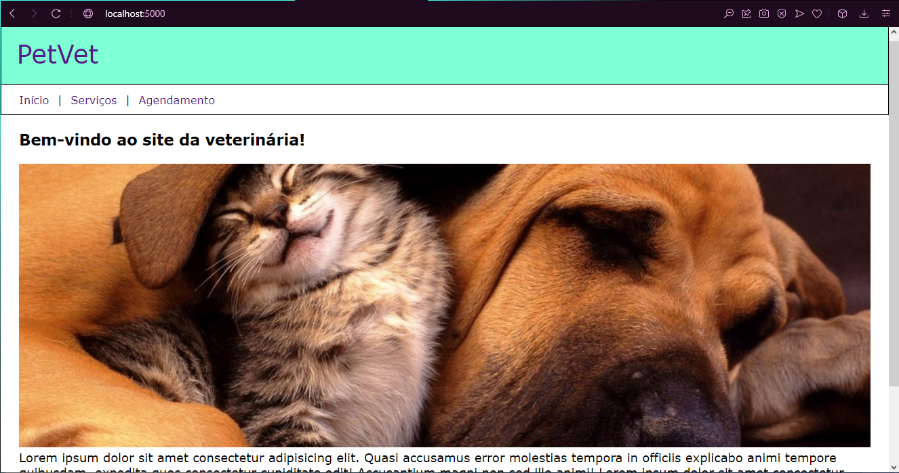
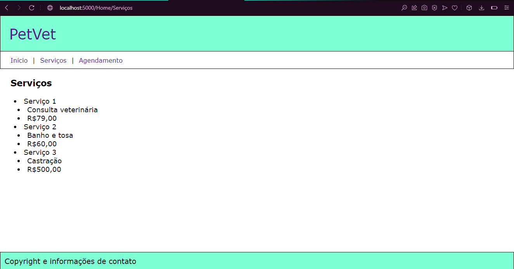
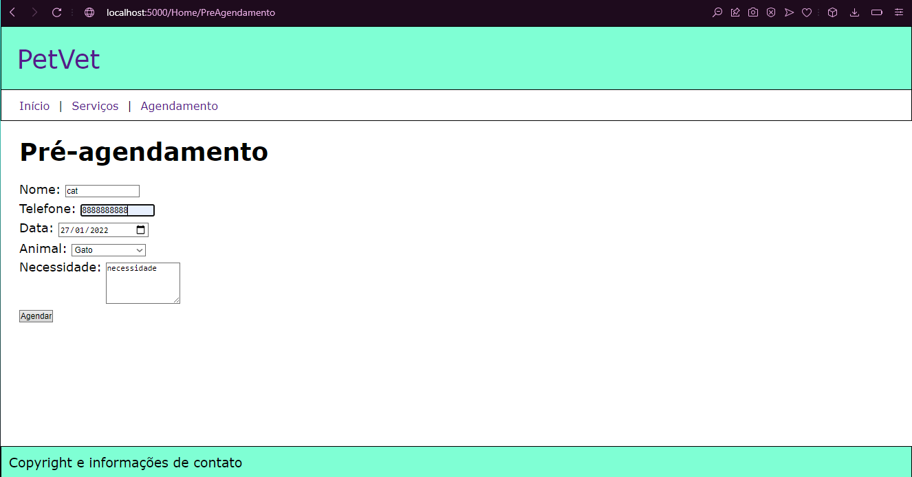
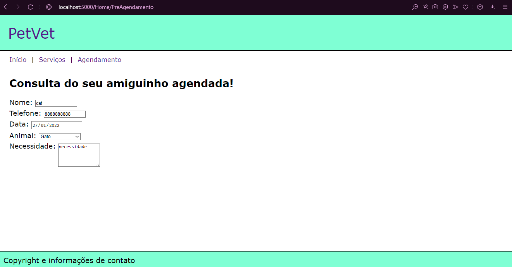

# README

Desenvolvi esse projeto para estudar e atender à atividade proposta no curso Técnico de Informática para Internet do Senac.

A atividade consistia em desenvolver uma prévia de um site para uma empresa de serviços veterinários, utilizando a estrutura ASP.NET Core MVC. As linguagens utilizadas foram HTML, CSS e C#.

Precisava ser criado um layout simples e 4 páginas: Index, Serviços, Pré-Agendamento e Agendamento concluído

# Index 

Nessa página, precisava ter uma mensagem de boas-vindas, uma imagem larga e texto abaixo.

# Serviços

Nessa página, precisava desenvolver uma lista com os serviços oferecidos pela empresa.

# Pré-Agendamento

Nessa página, precisava desenvolver um formulário para agendar consulta. Ao preencher todos os itens, o usuário é direcionado para página de Agendamento concluído.

# Agendamento concluído

Essa página só aparece para o usuário quando clica em "agendar" na página de agendamento. Aqui mostra exatamente as informações fornecidas na página anterior, confirmando o agendamento.

